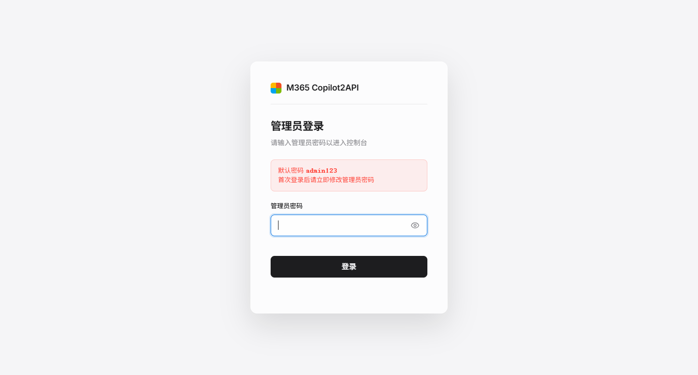
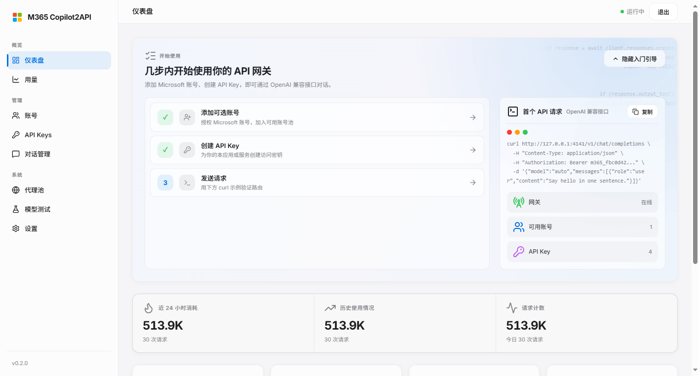
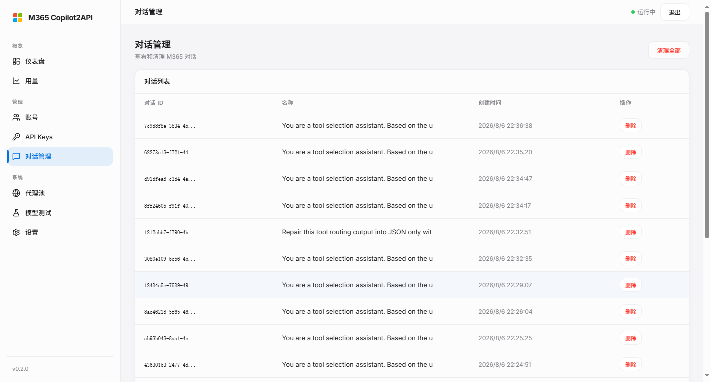
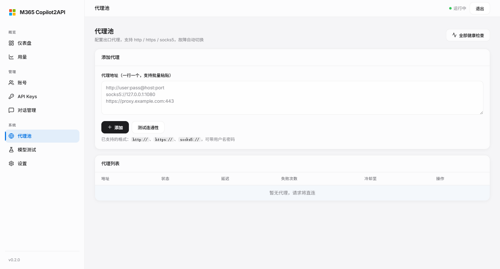
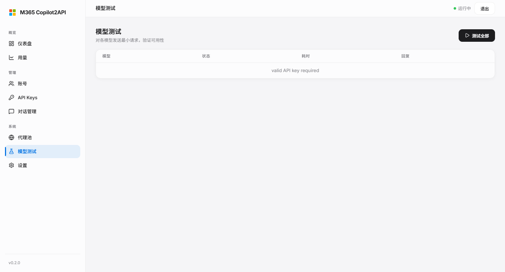

# M365 Copilot2API

<p align="center">
  
  
  
  
  
  
  <br>
  
</p>

<p align="center">
  <strong>M365 Copilot ChatHub 网关</strong><br>
  将 Microsoft 365 Copilot 转换为 OpenAI / Anthropic 兼容 API
</p>

---

## 📌 项目简介

M365 Copilot2API 是一个用 Go 编写的网关服务，将 Microsoft 365 Copilot 的 **ChatHub 私有协议**（SignalR / WebSocket）翻译为标准的 **OpenAI / Anthropic 兼容 API**，让 Claude Code、Cursor、Codex 等主流 AI 编程工具可以直接以官方格式接入 M365 Copilot 的能力。

一句话概括工作原理：**ChatHub 私有协议 ⇄ OpenAI / Anthropic 兼容 API**。你不需要关心 ChatHub 的握手、心跳、事件流和消息结构，网关把这些全部封装在 `internal/chathub` 层，对外暴露你熟悉的 `/v1/chat/completions`、`/v1/responses`、`/v1/messages` 接口。

项目自带完整的 Web 管理控制台，覆盖账号授权（PKCE）、API Key 管理、代理池、对话管理、用量统计与模型测试，适合个人自部署、自托管使用。

> ⚠️ **免责声明（请务必阅读）**
>
> - 本项目**不是微软官方产品**，与 Microsoft、OpenAI、Anthropic 及其关联公司**均无任何从属或合作关系**。
> - 使用第三方账号池、代理转发等方式接入 M365 服务**可能违反服务商服务条款**，由此产生的一切后果由使用者自行承担。
> - 请遵守当地法律法规与目标平台的服务条款（ToS）。
> - 本项目**仅供个人学习与研究**，**禁止用于商业转售或规模化运营**。
> - 账号被封禁、数据丢失等任何损失，本项目维护者与贡献者**概不负责**。

## 📋 功能特性

| 功能 | 说明 |
|------|------|
| ✅ OpenAI 兼容 `/v1/chat/completions` | 支持流式输出与工具调用 |
| ✅ OpenAI Responses `/v1/responses` | 兼容 Responses 协议 |
| ✅ Anthropic 兼容 `/v1/messages` | Claude Code / Cursor 直连 |
| ✅ 流式输出 (SSE) | 实时逐字输出 |
| ✅ 推理模型 | 按 `reasoning_effort` 路由上游 tone |
| ✅ 联网搜索 | `claude-sonnet` 内置 web_fetch |
| ✅ MCP 协议 | 内置 MCP 服务器，`/v1/mcp/sse` + `/v1/mcp/message` + `/v1/mcp/tools` |
| ✅ 视觉识别 | 支持 base64 图片输入 |
| ✅ 多账号管理 | PKCE OAuth 授权 + 账号轮询 (round-robin) |
| ✅ 多账号故障转移 | 请求账号故障自动切换下一个 |
| ✅ API Key 管理 | 控制台创建/撤销 + 完整密钥回读 |
| ✅ 代理池 | Web 管理页增删查、健康检查、失败冷却 |
| ✅ 对话管理系统 | 列表 / 删除 / 滑动清理 + 防串号会话绑定 |
| ✅ 对话自动清理 | 闲置超时回收 + 数量上限（类缓存生命周期） |
| ✅ 用量统计 | 按 key / 模型 / 端点聚合的 usage 仪表盘 |
| ✅ 缓存命中统计 | 命中率、节省 token、缓存状态仪表盘 |
| ✅ Web 管理控制台 | 账号、密钥、代理池、模型测试、对话、日志一屏管理 |

## 📸 界面预览

网关自带 Web 控制台，所有管理操作均可在浏览器内完成。

| 登录页 | 仪表盘 |
|--------|--------|
|  |  |

| 对话管理 | 代理池 | 模型测试 |
|----------|--------|----------|
|  |  |  |

更多界面截图见 [docs/screenshots/](docs/screenshots/)（用量统计、账号管理、API Key 管理、设置页等）。

## 🚀 快速开始

### 源码编译

要求：Go 1.23+（`go.mod` 声明的最低版本）。

```bash
git clone https://github.com/HEXUXIU/M365-Copilot2API.git
cd M365-Copilot2API

# 设置管理员密码（可选，默认 admin123）
export M365_ADMIN_PASSWORD=your_password

go run ./cmd/server
```

默认监听 `http://127.0.0.1:4141`，浏览器打开后完成管理员初始化，即可在控制台 PKCE 授权你的 M365 账号。

### Docker 部署

```bash
docker compose up -d --build
```

镜像内默认以非 root 的 `m365` 用户运行，数据目录挂载在 `./data`，管理员密码通过 `./secrets/m365_admin_password` 文件注入（见 [docker-compose.yml](docker-compose.yml)）。

## 🗺 部署指南

### 完整三步

**1. 克隆并编译**

```bash
git clone https://github.com/HEXUXIU/M365-Copilot2API.git
cd M365-Copilot2API
go build -o m365-native ./cmd/server
```

**2. 设置管理员密码环境变量**

```bash
# Linux / macOS
export M365_ADMIN_PASSWORD=your_strong_password
```

```powershell
# Windows PowerShell
$env:M365_ADMIN_PASSWORD = "your_strong_password"
```

> 生产环境请务必设置强密码，不要使用默认的 `admin123`。

**3. 启动并完成初始化**

```bash
./m365-native
```

启动后浏览器访问 `http://127.0.0.1:4141`：

1. 使用管理员密码登录（首次登录会**强制要求修改密码**）。
2. 在控制台发起 **PKCE 授权**，按引导完成 M365 账号登录。
3. 授权成功后创建 API Key，即可开始对接 Claude Code / Cursor 等工具。

### 生产部署建议

**反向代理 + TLS（推荐）**

网关默认只监听 localhost，如需对外提供服务，务必通过反向代理终止 TLS。以下为 Nginx 与 Caddy 的参考配置。

```nginx
# Nginx
server {
    listen 443 ssl;
    server_name m365.example.com;

    ssl_certificate     /path/to/fullchain.pem;
    ssl_certificate_key /path/to/privkey.pem;

    location / {
        proxy_pass http://127.0.0.1:4141;
        proxy_set_header Host $host;
        proxy_set_header X-Real-IP $remote_addr;
        proxy_set_header X-Forwarded-For $proxy_add_x_forwarded_for;
        proxy_set_header X-Forwarded-Proto $scheme;

        # SSE 流式输出需要关闭缓冲，同时支持 WebSocket 升级
        proxy_http_version 1.1;
        proxy_set_header Upgrade $http_upgrade;
        proxy_set_header Connection "upgrade";
        proxy_buffering off;
    }
}
```

```caddy
# Caddy（自动申请/续期 HTTPS 证书）
m365.example.com {
    reverse_proxy 127.0.0.1:4141
}
```

**仅内网监听**：默认 `M365_LISTEN=127.0.0.1:4141` 只绑定本机；Docker 部署时端口映射同样只暴露在 `127.0.0.1`（见 docker-compose.yml），避免网关直接暴露公网。

**数据目录备份**：账号凭据、API Key、会话绑定与用量数据均持久化在数据目录（默认 `data/`，含 `accounts.json`、`token-cache.json`、`sessions.json`、`api-keys.json` 等）。请定期备份，并确保目录权限仅对运行用户可读（建议 0700）。

**进程守护**：仓库自带 `manage.py` 一键管理脚本，支持 `start / stop / status / logs / err`：

```bash
python manage.py start
python manage.py status
python manage.py logs
```

Windows 下直接 `python manage.py start` 即可后台启动；Linux 上也可以用 systemd 守护：

```ini
# /etc/systemd/system/m365-native.service
[Unit]
Description=M365 Copilot2API Gateway
After=network.target

[Service]
WorkingDirectory=/opt/M365-Copilot2API
ExecStart=/opt/M365-Copilot2API/m365-native
Environment=M365_ADMIN_PASSWORD=change-me
Environment=M365_LISTEN=127.0.0.1:4141
Restart=always
RestartSec=3
User=m365

[Install]
WantedBy=multi-user.target
```

> 注意：`manage.py` 内部使用仓库绝对路径（默认 `D:\M365-Copilot2API\m365-native.exe`），部署到其他目录时请按需修改脚本顶部路径，并确保先完成编译。

## 🔑 使用示例

```bash
# 基础聊天（OpenAI 格式）
curl http://127.0.0.1:4141/v1/chat/completions \
  -H "Authorization: Bearer YOUR_API_KEY" \
  -H "Content-Type: application/json" \
  -d '{
    "model": "gpt-5.5",
    "messages": [{"role": "user", "content": "你好"}]
  }'

# 流式输出
curl http://127.0.0.1:4141/v1/chat/completions \
  -H "Authorization: Bearer YOUR_API_KEY" \
  -H "Content-Type: application/json" \
  -d '{
    "model": "gpt-5.5-reasoning",
    "messages": [{"role": "user", "content": "1+1=?"}],
    "stream": true
  }'

# Anthropic 格式（Claude Code / Cursor）
curl http://127.0.0.1:4141/v1/messages \
  -H "x-api-key: YOUR_API_KEY" \
  -H "anthropic-version: 2023-06-01" \
  -H "Content-Type: application/json" \
  -d '{"model":"gpt-5.2","max_tokens":1024,"messages":[{"role":"user","content":"你好"}]}'

# 联网搜索（claude-sonnet 内置）
curl http://127.0.0.1:4141/v1/chat/completions \
  -H "Authorization: Bearer YOUR_API_KEY" \
  -H "Content-Type: application/json" \
  -d '{
    "model": "claude-sonnet",
    "messages": [{"role": "user", "content": "北京今天天气？"}]
  }'
```

## 🤖 对接 Claude Code 与 Cursor

### Claude Code

在 `~/.claude/settings.json` 的 `env` 中持久指向网关：

```json
{
  "env": {
    "ANTHROPIC_BASE_URL": "http://127.0.0.1:4141",
    "ANTHROPIC_MODEL": "gpt-5.6-sol",
    "ANTHROPIC_API_KEY": "m365_你的密钥"
  }
}
```

> ⚠️ **认证冲突提醒**：如果系统环境变量残留了 `ANTHROPIC_API_KEY`，或同时配置了 `ANTHROPIC_AUTH_TOKEN`，Claude Code 会告警"认证可能不工作"。请**二选一**：`settings.json` 的 `env` 会覆盖系统级变量，但混用 `API_KEY` 与 `AUTH_TOKEN` 两种认证方式会冲突。

### Cursor

在 Cursor 的 Settings 中配置与 Claude Code 相同的三个环境变量（`ANTHROPIC_BASE_URL`、`ANTHROPIC_MODEL`、`ANTHROPIC_API_KEY`），或通过终端启动 Cursor 时注入，即可让 Cursor 走网关调用 M365 Copilot。

## 📚 可用模型

| 模型 | 推荐用途 | 实测速度 |
|------|---------|---------|
| `gpt-5.2` | 最轻量快速 | ⚡ TTFT ~2.0s / 40ch/s |
| `gpt-5.3` | 日常对话 | ⚡ TTFT ~1.6s / 32ch/s |
| `gpt-5.4` | 日常对话 | ⚡ TTFT ~1.9s / 37ch/s |
| `gpt-5.5` | 日常对话 | ⚡ ~5s |
| `gpt-5.6-sol` | 复杂推理（默认高推理） | ⏳ TTFT ~1.5s / 16ch/s |
| `gpt-5.6-terra` | 复杂推理 | ⏳ TTFT ~1.6s / 13ch/s |
| `claude-sonnet` | 联网搜索、实时信息 | ⚡ TTFT ~3.7s / 35ch/s |
| `gpt-5.2-reasoning` | 数学/逻辑推理 | ⏳ TTFT ~2.2s / 19ch/s |
| `gpt-5.4-reasoning` | 深度推理 | ⏳ TTFT ~3.9s / 16ch/s |
| `gpt-5.5-reasoning` | 深度推理 | ⏳ TTFT ~4.0s / 15ch/s |
| `gpt-5.6-reasoning` | 深度推理（默认最高） | ⏳ TTFT ~2.2s / 15ch/s |
| `claude-sonnet-reasoning` | 深度推理 + 联网 | ⏳ TTFT ~4.8s |

> 基准为 200 字中文短文实测（TTFT=首字节延迟，ch/s=吞吐）。`-reasoning` 后缀模型会把推理程度映射为上游 tone，可通过 `reasoning_effort`（`none` / `minimal` / `low` / `medium` / `high` / `xhigh`）微调。

## 🧠 架构与工作原理

```
┌──────────────┐    OpenAI/Anthropic    ┌──────────────────┐    ChatHub    ┌──────────────┐
│ Claude Code  │ ─────────────────────► │     网关          │ ────────────► │ M365 Copilot │
│ Cursor       │   /v1/chat/completions │ (Go, m365-native) │  SignalR/WS   │ (云端对话)    │
│ 任意 OpenAI  │   /v1/messages         │  internal/web     │  internal/    │              │
│ 客户端       │   /v1/responses        │                   │  chathub      │              │
└──────────────┘                        └──────────────────┘               └──────────────┘
```

**ChatHub 协议层（`internal/chathub`）**：封装 M365 Copilot ChatHub 的 WebSocket / SignalR 私有协议——连接建立、心跳保活、事件流解析（流式 token、工具调用、多模态输入）全部在这一层完成，对上层暴露统一的事件接口。

**会话绑定防串号（`internal/web/session_resolver.go`）**：多账号场景下最危险的错误是"串号"——请求被路由到错误的账号导致对话上下文混乱。网关通过 **会话 ID / user 字段 / IP 指纹 / 上下文相似度** 四重指纹识别客户端，将每个客户端会话稳定绑定到固定账号与云端对话（`M365_SESSION_TTL_MINUTES` 控制绑定存活，`M365_CONTEXT_TTL_MINUTES` + `M365_CONTEXT_SIMILARITY` 控制上下文指纹匹配窗口与阈值）。

**账号轮询与故障转移**：多账号间按 round-robin 均衡流量；单次请求若账号故障（鉴权失效、连接断开等），自动切换到下一个可用账号重试，无需人工干预。

**代理池（`internal/outbound`）**：支持 HTTP / HTTPS / SOCKS5 代理池轮换。代理连续失败进入冷却（冷却时长随失败次数指数递增，上限 2 分钟），健康检查可用 `M365_PROXY_HEALTH_URL` 自定义探测目标；HTTP 请求失败会自动换下一个健康代理重试。

**对话自动清理**：云端对话被视作"缓存条目"——会话复用 = 命中（自动刷新存活时间），新建会话 = 未命中。后台循环（默认每 30 分钟）回收闲置超过 `M365_AUTO_CLEANUP_MAX_AGE_HOURS`（默认 72 小时）或超出数量上限 `M365_AUTO_CLEANUP_KEEP_N`（默认 100）的对话；**白名单对话、有活跃会话绑定的对话、正在使用的用户会话永不回收**。删除云端对话时联动清理本地索引与防串号绑定，杜绝幽灵会话。

**技术栈**：Go 1.23+ · ChatHub (SignalR/WebSocket) · SSE · MCP · 单页 HTML 控制台（Inter 字体 + Lucide 图标） · Docker / 裸机双部署。

## ⚙️ 配置参考

全部通过环境变量配置，可用 `.env.example` 作为起点。

### 服务

| 变量 | 默认值 | 说明 |
|------|--------|------|
| `M365_LISTEN` | `127.0.0.1:4141` | 监听地址 |
| `M365_ADMIN_PASSWORD` | `admin123` | 管理员密码（首次登录强制修改） |
| `M365_CHAT_TIMEOUT_SECONDS` | `120` | 聊天超时（秒） |
| `M365_IMAGE_TIMEOUT_SECONDS` | `150` | 图片处理超时（秒） |
| `M365_CONTEXT_WINDOW` | `128000` | 上下文窗口 |
| `M365_MAX_OUTPUT_TOKENS` | `16384` | 最大输出 Token |
| `M365_LOG_LEVEL` | `info` | 日志级别 |
| `M365_TOOL_PLANNING_MODE` | `router` | 工具规划模式（`router` / `native`） |
| `M365_USER_SESSION_TTL_MINUTES` | `30` | 用户会话存活时间 |
| `M365_SESSION_TTL_MINUTES` | `30` | 会话绑定存活时间 |
| `M365_CONTEXT_TTL_MINUTES` | `5` | 上下文指纹匹配窗口 |
| `M365_CONTEXT_SIMILARITY` | `0.6` | 上下文相似度阈值 |

### 自动清理

`M365_AUTO_CLEANUP_*` 控制云端对话回收，`M365_CLEANUP_*` 控制本地索引清理。

| 变量 | 默认值 | 说明 |
|------|--------|------|
| `M365_AUTO_CLEANUP` | `1` | 云端自动清理开关（`0` 关闭） |
| `M365_AUTO_CLEANUP_INTERVAL_MINUTES` | `30` | 扫描周期（分钟） |
| `M365_AUTO_CLEANUP_MAX_AGE_HOURS` | `72` | 闲置超过即回收（小时） |
| `M365_AUTO_CLEANUP_KEEP_N` | `100` | 最多保留的云端对话数 |
| `M365_CLEANUP_MODE` | `after_response` | 本地索引清理模式（`after_response` / `keep_n` / `max_age`） |
| `M365_CLEANUP_KEEP_N` | `5` | `keep_n` 模式的保留量 |
| `M365_CLEANUP_MAX_AGE_HOURS` | `24` | `max_age` 模式的时限 |

### 代理池

| 变量 | 默认值 | 说明 |
|------|--------|------|
| `M365_PROXY_POOL` | `""` | 代理列表（逗号或换行分隔，支持 http / https / socks5） |
| `M365_PROXY_INSECURE_TLS` | — | 信任自签代理证书或 IP 直连（`1` / `true`；IP 形式直连自动启用） |
| `M365_PROXY_HEALTH_URL` | 微软连接测试页 | 代理健康检查探测地址 |

### 数据与认证

| 变量 | 默认值 | 说明 |
|------|--------|------|
| `M365_DATA_DIR` | — | 数据目录（token、密钥等集中存储） |
| `M365_CONFIG` | `~/.config/m365-native/accounts.json` | 账号配置文件路径 |
| `M365_TOKEN_CACHE` | — | token 缓存文件 |
| `M365_SESSION_CACHE` | — | 会话绑定缓存文件 |
| `M365_CONVERSATION_CACHE` | — | 对话缓存文件 |
| `M365_USER_SESSION_CACHE` | — | 用户会话缓存文件 |
| `M365_API_KEYS` | — | API Key 存储文件 |
| `M365_USAGE_LOG` | — | 用量统计存储文件 |
| `M365_CLIENT_ID` | — | Azure 应用 Client ID（默认用内置） |
| `M365_AUTHORITY` / `M365_REDIRECT_URI` / `M365_SCOPE` | — | OAuth 自定义端点覆盖 |
| `M365_DEBUG_LOG` | — | 调试日志文件（记录请求/响应元数据） |
| `M365_ADMIN_PASSWORD_FILE` / `M365_ADMIN_PASSWORD_BOOTSTRAP_FILE` | — | 持久化密码文件 / 启动引导密码文件（Docker secret 用） |

## 🔌 API 参考

### OpenAI 兼容

| 端点 | 方法 | 说明 |
|------|------|------|
| `/v1/chat/completions` | POST | 聊天补全（流式 / 工具调用） |
| `/v1/responses` | POST | OpenAI Responses 协议 |
| `/v1/models` | GET | 模型列表 |
| `/v1/images/generations` | POST | 图像生成 |

### Anthropic 兼容

| 端点 | 方法 | 说明 |
|------|------|------|
| `/v1/messages` | POST | Messages API（需 `x-api-key` + `anthropic-version` 头） |

### 会话管理

| 端点 | 方法 | 说明 |
|------|------|------|
| `/v1/sessions` | GET / POST | 查询会话绑定 / 查询或创建指定 `session_id` 的绑定 |
| `/v1/sessions/{id}` | DELETE | 解除会话绑定 |

### MCP 协议

| 端点 | 说明 |
|------|------|
| `GET /v1/mcp/sse` | SSE 连接 |
| `POST /v1/mcp/message` | JSON-RPC 消息 |
| `GET /v1/mcp/tools` | 工具列表 |

### 管理端点（/api/\*）

| 端点 | 说明 |
|------|------|
| `/api/admin/login` · `/api/admin/logout` · `/api/admin/session` | 管理员登录态管理 |
| `/api/admin/change-password` | 修改管理员密码（首次登录强制） |
| `/api/admin/keys` | API Key 增删与回读 |
| `/api/admin/settings` | 运行时设置查看与修改 |
| `/api/admin/proxy-pool` | 代理池增删查 |
| `/api/accounts` · `/api/accounts/refresh` · `/api/accounts/delete` | 账号管理 |
| `/api/auth/start` · `/api/auth/status` · `/api/auth/callback` | PKCE 授权流程 |
| `/api/conversations` · `/api/m365/conversations` | 本地 / 云端对话列表与删除 |
| `/api/stats` · `/api/usage` | 缓存命中统计 / 用量统计 |
| `/api/chat` · `/api/chat/stream` | 控制台内即时对话（调试用） |
| `/api/health` | 健康检查 |

## 🛡 安全说明

- **默认仅监听 localhost**：`M365_LISTEN=127.0.0.1:4141`，未经配置不会暴露公网。
- **首次登录强制改密**：使用默认密码或引导密码完成首次登录后，必须修改管理员密码。
- **密钥最小暴露**：API Key 仅在创建时展示完整密钥，但管理页提供完整的密钥回读能力——请妥善保护控制台访问权限。
- **对外暴露请走 TLS**：如需对外提供服务，务必通过反向代理终止 TLS（见"生产部署建议"）。
- **敏感数据落盘加密权限**：账号凭据、会话绑定、API Key 等数据文件均以 `0600` 权限写入，仅运行用户可读；数据目录建议 `0700`。

## ❓ 常见问题

**Q1：为什么我的云端对话越来越多？**

网关默认启用自动清理：后台每 30 分钟扫描一次，回收闲置超过 72 小时、或超出数量上限（默认保留 100 个）的云端对话；白名单对话、有活跃会话绑定的对话永不回收。如果你觉得清理太保守，可以调低 `M365_AUTO_CLEANUP_MAX_AGE_HOURS` 和 `M365_AUTO_CLEANUP_KEEP_N`；彻底关闭用 `M365_AUTO_CLEANUP=0`（不推荐，云端对话会无限膨胀，可能触发风控）。

**Q2：如何切换 M365 账号？**

不需要手动切换。多账号场景下，网关会自动 round-robin 轮询所有可用账号，单个账号故障时自动故障转移到下一个。要增加账号，直接在控制台发起新的 PKCE 授权即可。

**Q3：Claude Code 提示"认证可能不工作"怎么办？**

通常是系统环境变量残留了 `ANTHROPIC_API_KEY`，或同时配置了 `ANTHROPIC_AUTH_TOKEN` 导致认证方式冲突。请二选一：只保留 `~/.claude/settings.json` 中的 `ANTHROPIC_API_KEY`（settings 会覆盖系统级变量），并删除 `AUTH_TOKEN` 或系统级残留。

**Q4：感觉响应慢，该选哪个模型？**

- 追求速度：`gpt-5.2`（TTFT ~2.0s，40ch/s，最快）。
- 复杂推理：`gpt-5.6-sol`（TTFT ~1.5s，高推理质量）。
- 需要联网/实时信息：`claude-sonnet`（内置 web_fetch）。
- 想手动控制推理深度：用 `-reasoning` 系列模型 + `reasoning_effort` 参数。

## 🤝 贡献指南

PRs Welcome！提交前请留意：

1. Fork 仓库并创建独立分支，一个 PR 聚焦一个问题。
2. 切勿提交任何凭据、cookie、账号缓存、日志或构建产物。
3. 改动 Go 文件前先 `gofmt -w`，提交前跑完 `go test ./...`、`go vet ./...` 与 `go build ./...`。
4. 描述行为变化，涉及新逻辑时附上对应测试。

详见 [CONTRIBUTING.md](CONTRIBUTING.md)。

## 📝 许可证

[MIT License](LICENSE)，Copyright (c) 2026 m365-native contributors。
